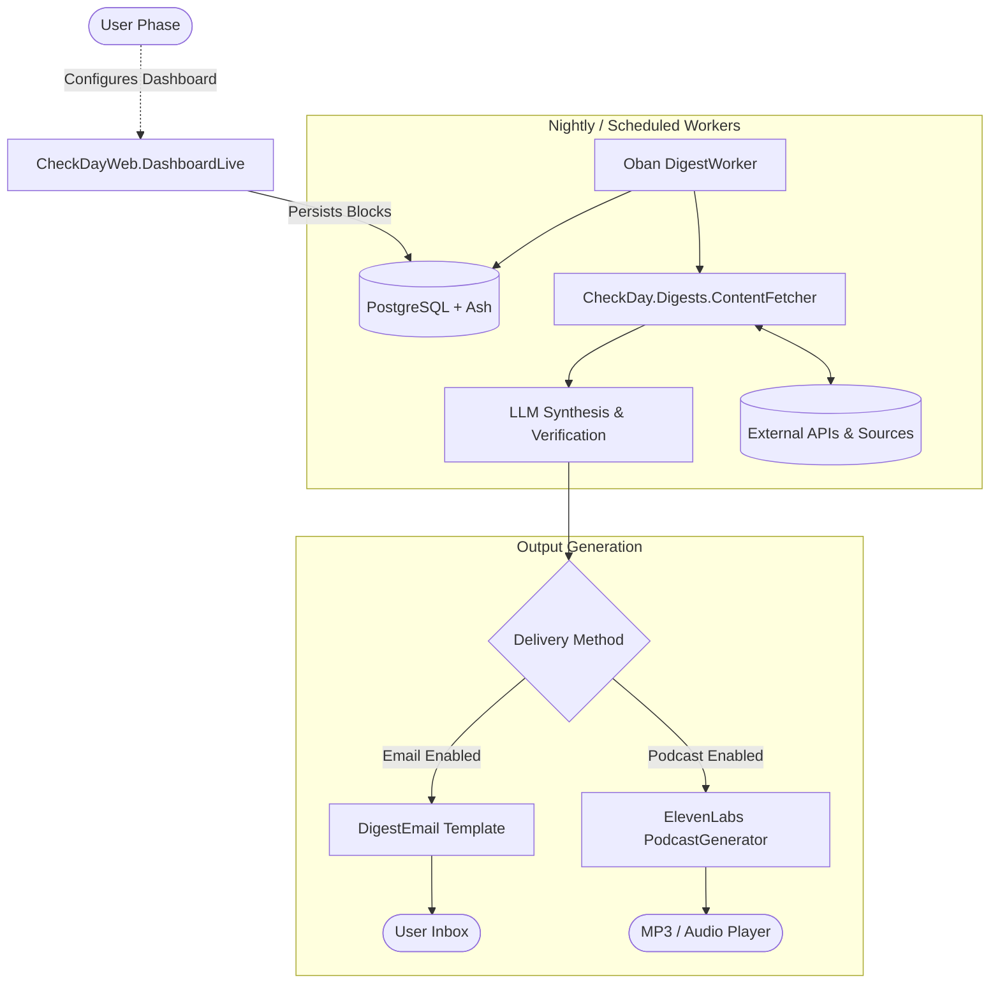
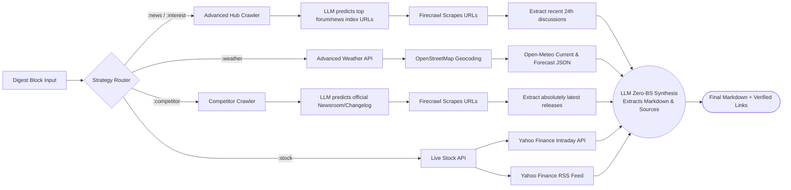

# Check.Day

**Check.Day** is designed to replace the blaring morning alarm with hyper-personalized, high-signal intelligence briefings. It delivers verified facts, industry news, competitor updates, and weather forecasts either as beautifully designed emails or studio-quality morning podcasts.

With a heavy emphasis on zero AI hallucinations, Check.Day utilizes robust retrieval mechanisms—from official changelogs to financial APIs—to ensure every intel brief is grounded in absolute truth and we always expose the sources.

## Check.Day ❤️ OpenSource 

Check.day created the following open source Elixir packages:
- [Firecrawl](https://hex.pm/packages/firecrawl)
- [ElevenLabs](https://hex.pm/packages/eleven_labs)

## Features

- **Email or Podcast Delivery**: Consume your morning updates however you prefer. Skim an email at your desk, or listen to a studio-ready podcast powered by ElevenLabs on your commute.
- **Signal over Noise**: Track specific competitors, industry trends, and market metrics that actually impact your bottom line.
- **Verified Sources**: Utilizing industry-standard Firecrawl technology, our verification pipelines guarantee factual sourcing with no AI fabrication.
- **Hyper-Personalization**: Dashboards and digest configurations are strictly bound to individual user profiles, generating tailored requests on a configurable daily schedule.
- **Dark-Mode Glassmorphism UI**: A premium, responsive interface tailored for professionals.

## Architecture Overview

The system runs heavily highly-concurrent background workers to assemble the intelligence briefings before the user's scheduled delivery time.

## Content Fetching Strategies

`CheckDay.Digests.ContentFetcher` is the core anti-hallucination engine. Instead of relying on a single broad search strategy, the fetcher intelligently routes different digest blocks (`:news`, `:interest`, `:competitor`, `:stock`, `:weather`) to hardened, specialized retrieval pipelines via `Task.async_stream`.

1. **Advanced Hub Crawler (`:news`, `:interest`)**: Predicts the absolute best discussion/aggregator index links for a topic, concurrently scrapes them using Firecrawl, extracts *only* top discussions from the last 24-48 hours, and synthesizes the community sentiment.
2. **Advanced Weather API (`:weather`)**: Avoids hallucinated temperatures by fetching rigorous JSON arrays from Open-Meteo and strictly prompting the LLM to write a summary backed *only* by the integers in the payload.
3. **Advanced Competitor Crawler (`:competitor`)**: Predicts official domains for changelogs and blogs. Parses them purely for actual company announcements (not arbitrary articles) to track momentum.
4. **Live Stock API (`:stock`)**: Couples current intraday chart data with raw RSS headlines from Yahoo Finance so that stock movement descriptions are tied to actual breaking narratives, rather than fabricated contexts.
5. **Basic Search (Legacy/Fallback)**: Issues a daily query via Firecrawl, scrapes matching content, parses markdown, and deduplicates to build a coherent digest out of raw web results.

## Running Locally

1. Setup dependencies: `mix deps.get`
2. Configure external keys (ElevenLabs, Firecrawl, Anthropic/OpenAI) via environment variables or `.env`.
3. Create and migrate database: `mix ecto.setup` (or `mix ash.setup` if aliases are configured)
4. Start Phoenix endpoint: `mix phx.server` or inside IEx with `iex -S mix phx.server`